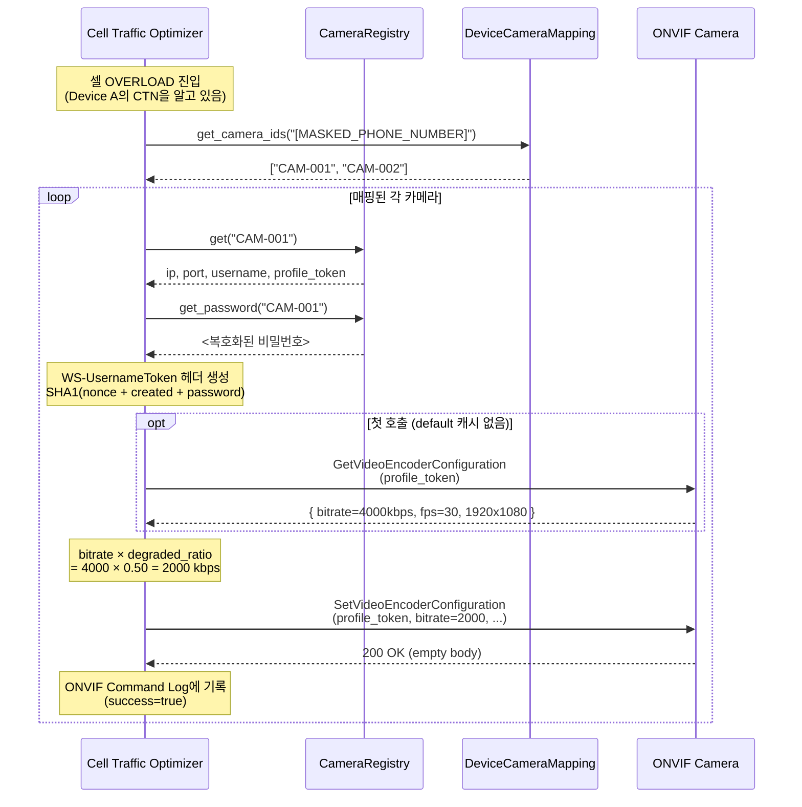

# 단말 연동 규격서 (Terminal Integration Specification)

| 항목 | 내용 |
|------|------|
| 문서 번호 | NWLoad-TRM-001 |
| 버전 | 1.0 |
| 작성일 | 2026-05-15 |
| 적용 시스템 | Cell Traffic Optimizer |
| 관련 문서 | NWLoad-PKT-001 (패킷 규격), NWLoad-API-001 (백엔드 API), NWLoad-FE-001 (프론트엔드) |

---

## 1. 개요

### 1.1 목적

본 규격서는 무선 CCTV 단말(LTE/5G 라우터)을 Cell Traffic Optimizer 시스템에 통합·운용할 때 단말 측·서버 측에서 수행해야 할 등록·매핑·설정 절차와, 단말과 카메라 간 ONVIF 연동에 필요한 정보의 등록 위치를 정의한다.

### 1.2 통합 단계 개요

새 단말을 시스템에 연결할 때 거치는 5단계.

```
① 단말 펌웨어 설정     : 서버 IP/Port 입력, 패킷 송신 활성화
② 카메라 ONVIF 사전 설정 : 카메라 자체에 사용자/프로파일 토큰 생성
③ 서버에 카메라 등록    : POST /api/cameras
④ 단말↔카메라 매핑 등록 : POST /api/mappings
⑤ 연동 검증            : 패킷 수신 확인, OVERLOAD 시 화질 저하 확인
```

이 문서는 ①~⑤를 모두 다루며, 특히 ②~④에서 **어떤 정보를 어디에 등록해야 하는지** 명확히 안내한다.

### 1.3 현재 운영 환경 (v0.1.0)

| 항목 | 값 |
|------|-----|
| 백엔드 도메인 | `https://nwload-production.up.railway.app` |
| 프론트엔드 도메인 | `https://nwload.vercel.app` |
| UDP 수신 | ❌ Railway 미지원 (로컬 백엔드에서만 가능) |
| HTTPS 패킷 인입 | ✅ `POST /api/ingest/packet` |
| 슬라이딩 윈도우 | 60초 |
| Recovery Cooldown | 60초 |
| Step-Up Interval | 60초 |
| Degraded Ratio | 0.50 (DEGRADED 시 default × 50%) |
| Step-Up Ratio | 0.75 (STEP_UP 시 default × 75%) |

---

## 2. 단말 측 사전 설정

### 2.1 펌웨어 요구사항

단말(LTE/5G 라우터)은 다음을 충족해야 한다:

- 67바이트 고정 길이 바이너리 패킷 생성 (NWLoad-PKT-001 참조)
- UDP 송신 기능 (사설망/로컬 백엔드용)
- HTTPS POST 송신 기능 (클라우드 호스팅용)
- 60초 간격 주기 송신 (권장)
- 단말 자체 식별자(`Router_CTN`) = 단말에 장착된 USIM의 전화번호(MSISDN)

### 2.2 단말에 입력해야 할 서버 정보

| 항목 | 값 | 비고 |
|------|-----|------|
| 서버 호스트 | `nwload-production.up.railway.app` 또는 로컬 PC IP | 환경별 선택 |
| UDP 포트 | `9000` | 로컬 백엔드 한정 (Railway는 UDP 미지원) |
| HTTPS endpoint | `https://nwload-production.up.railway.app/api/ingest/packet` | 클라우드 환경에서는 이 채널 사용 |
| 전송 주기 | 60초 (권장) | 단말 펌웨어 설정 |
| 패킷 형식 | 67B Big-Endian, Version=0x01, MsgType=0x01 | NWLoad-PKT-001 |

### 2.3 단말이 보고할 핵심 필드

| 필드 | 값 출처 | 비고 |
|------|--------|------|
| `Router_CTN` | 자체 USIM MSISDN (예: `[MASKED_PHONE_NUMBER]`) | 시스템 전역 단말 식별자 |
| `PLMN_ID` | 현재 접속 망 (예: 450/06 = Uplus) | BCD 인코딩 |
| `ECGI` / `NCI` | 현재 접속 셀의 식별자 | 모뎀 AT 명령 등으로 조회 |
| `ARFCN` | 현재 채널 번호 | EARFCN(LTE) 또는 NR-ARFCN(5G) |
| `Timestamp` | 측정 시각 (Unix ms) | 시간 동기화 필수 (NTP 권장) |
| `UL_RB_Usage` | 0~100 | 단말이 자기 자신이 사용 중인 업링크 RB |

### 2.4 전송 채널 선택 결정 트리

```
백엔드가 어디에 있나요?
  ├─ 로컬 PC (개발/테스트)         → UDP 9000 사용 (--mode realtime)
  ├─ 사내 서버 (사설망)            → UDP 9000 사용
  └─ 클라우드 (Railway 등)         → HTTPS POST /api/ingest/packet 사용
                                       (Content-Type: application/octet-stream)
```

---

## 3. ONVIF 카메라 사전 설정 (카메라 본체)

### 3.1 카메라 본체에서 미리 확보해야 할 정보

서버에 카메라를 등록하기 **전에**, 카메라 본체(또는 NVR)에서 다음을 준비한다.

#### 필수 5가지

| 항목 | 설명 | 예시 |
|------|------|------|
| **IP 주소** | 카메라의 IP. 단말과 같은 LAN 또는 라우팅 가능 네트워크 | `192.168.10.21` |
| **ONVIF 포트** | ONVIF 서비스 포트 (보통 80, 8080, 또는 제조사별 상이) | `80` |
| **사용자 계정 (Username)** | ONVIF 권한이 있는 계정. **Operator 이상 권한 필수** | `admin` |
| **비밀번호** | 위 계정의 비밀번호. WS-UsernameToken Digest 인증에 사용 | (자체 관리) |
| **Profile Token** | ONVIF Media Profile 식별자 | `Profile_1` |

#### 추가 3가지 (default 제공, 필요 시 변경)

| 항목 | 설명 | Default | 변경이 필요한 경우 |
|------|------|---------|------------------|
| **Use HTTPS** | 카메라 ONVIF 통신에 TLS 사용 여부 | `false` (http) | 카메라가 HTTPS만 허용하는 보안 모드일 때 |
| **Media Service Path** | ONVIF Media Service의 URL 경로 | `/onvif/media` | 일부 제조사(Axis 등)는 다른 경로 사용 — 카메라 본체의 ONVIF 설정 메뉴 또는 `GetServices` 응답에서 확인 |
| **Video Codec** | 인코더가 사용하는 코덱 (H.264/H.265) | `H264` | 카메라가 H.265만 지원하거나 H.265로 설정된 경우 |

> **모르겠으면 default 그대로 두세요.** 한국에서 흔히 사용되는 한화비전·Hikvision·Dahua 카메라는 default 값으로 정상 동작합니다. ONVIF 명령이 실패하면 ONVIF Command Log의 오류 메시지를 보고 위 3개 값을 조정합니다.

### 3.2 Profile Token이란?

ONVIF에서 각 카메라는 하나 이상의 **Media Profile**을 가집니다. 각 Profile은 (Video Encoder Config + Video Source Config + Audio Config) 같은 설정 묶음의 참조이고, **Profile Token**은 그 묶음의 고유 식별자입니다.

본 시스템은 `SetVideoEncoderConfiguration` 호출 시 이 token으로 어떤 프로파일을 변경할지 지정합니다.

**Profile Token 확인 방법** (택1):
- 카메라 웹 UI: `Configuration → Network → ONVIF` 또는 `Stream Settings`에서 노출되는 경우가 많음
- ONVIF Device Manager(공식 무료 도구)로 카메라 접속 후 Profiles 탭
- ONVIF `GetProfiles` 직접 호출 (curl/Postman으로 SOAP 요청)

제조사별 흔한 명명 규칙:

| 제조사 | 흔한 Profile Token |
|--------|-------------------|
| Hanwha (Hanwha Vision) | `Profile_1`, `Profile_2` |
| Hikvision | `Profile_1`, `Profile_2` |
| Dahua | `MediaProfile00000`, `MediaProfile00001` |
| Axis | `profile_1_h264`, 또는 사용자 정의 |

### 3.3 카메라 본체에서 미리 해두면 좋은 설정

| 설정 | 권장 값 | 이유 |
|------|--------|------|
| 인증 모드 | WS-UsernameToken Digest | 본 시스템 기본. Basic Auth는 미지원 |
| Encoding | H.264 | `SetVideoEncoderConfiguration`이 H.264로 요청. H.265는 별도 분기 필요 |
| Default Bitrate | 1500~4000 kbps | 너무 낮으면 DEGRADED 시 화질 식별 불가 |
| RTSP 인증 | 별도 운영 권장 | 본 시스템은 RTSP를 다루지 않음 |
| 시간 동기화 | NTP 활성화 | WS-UsernameToken의 timestamp가 어긋나면 인증 실패 |

### 3.4 카메라 사전 점검 절차

서버에 등록하기 전 다음을 확인하면 등록 실패 시간을 줄일 수 있다.

```
1) 카메라 IP에 ping이 되는가?
2) ONVIF Device Manager로 접속 가능한가?
3) GetProfiles로 profile_token 확인했는가?
4) GetVideoEncoderConfiguration이 응답하는가?
5) Operator 권한으로 SetVideoEncoderConfiguration 실행 가능한가?
```

---

## 4. 서버에 카메라 등록

### 4.1 등록 위치

**Camera Management 화면 → Camera Registry 섹션** 또는 **POST /api/cameras** API.

#### 방법 A — 웹 UI (Camera Management 화면)

```
1. 대시보드 좌측 사이드바 → 카메라 아이콘 클릭 (Camera Mgmt)
2. "Camera Registry" 카드의 우측 상단 [+ Add] 버튼 클릭
3. 입력 폼이 나타나면 다음 9개 필드 입력 (뒤 3개는 default 사용 가능):

   [필수]
     - Camera ID            (시스템 내 식별자, 임의 지정)
     - IP Address           (카메라 IP)
     - ONVIF Port           (보통 80)
     - Username             (ONVIF 계정)
     - Password             (해당 계정 비밀번호)
     - Profile Token        (예: "Profile_1")

   [Default 제공 — 필요 시 변경]
     - Media Service Path   (default: /onvif/media)
     - Video Codec          (default: H.264, H.265 선택 가능)
     - Use HTTPS            (default: off)

4. [Save] 클릭
```

#### 방법 B — REST API 직접 호출

```http
POST /api/cameras HTTP/1.1
Host: nwload-production.up.railway.app
Content-Type: application/json

{
  "cameraId":         "CAM-001",
  "ipAddress":        "192.168.10.21",
  "onvifPort":        80,
  "username":         "admin",
  "password":         "<카메라 비밀번호>",
  "profileToken":     "Profile_1",
  "useTls":           false,
  "mediaServicePath": "/onvif/media",
  "videoCodec":       "H264"
}
```

> 뒤 3개 필드는 default 값을 가지므로 생략 가능. 생략 시 서버가 자동으로 `useTls=false`, `mediaServicePath="/onvif/media"`, `videoCodec="H264"`를 적용한다.

응답 (201 Created):
```json
{
  "cameraId":         "CAM-001",
  "ipAddress":        "192.168.10.21",
  "onvifPort":        80,
  "username":         "admin",
  "profileToken":     "Profile_1",
  "isReachable":      true,
  "useTls":           false,
  "mediaServicePath": "/onvif/media",
  "videoCodec":       "H264"
}
```

### 4.2 비밀번호 처리

- 서버는 비밀번호를 **Fernet(AES-128)** 으로 암호화하여 메모리에 보관
- API 응답에는 비밀번호가 **포함되지 않음** (위 응답 예시에 password 없음 확인)
- 카메라 정보 수정 시 비밀번호를 바꾸지 않으려면 PUT 요청에서 `"password": null` 전송 → 기존 값 유지

### 4.3 Camera ID 명명 규칙 권장

| 규칙 | 예시 |
|------|------|
| 위치 기반 | `BLDG-A-101`, `LOBBY-WEST` |
| 일련번호 | `CAM-001`, `CAM-002` |
| 단말 결합 표기 | `R-[MASKED_PHONE_NUMBER]-01` (Router CTN과 결합) |

영문/숫자/하이픈/언더스코어 조합 권장. 공백·한글은 URL 호환을 위해 피한다.

### 4.4 ⚠️ 현재 운영상 제약 — 재배포 시 데이터 초기화

Railway 컨테이너는 재배포 시 **`CameraRegistry`의 메모리 데이터가 모두 사라진다.** 영구 저장이 필요한 운영 환경에서는:

- 서버 시작 시 외부 DB(Postgres 등)에서 카메라 정보를 로드하는 부트스트랩 추가 필요
- 또는 Railway Volume 마운트 + SQLite 영속화 (현재 `event_store`는 SQLite지만 `camera_registry`는 메모리)

현재 버전(v0.1.0)에서는 **재배포 후 카메라를 다시 등록해야 한다**는 점을 운영 절차에 포함해야 한다.

---

## 5. 단말-카메라 매핑 등록

카메라가 등록되어도 **어느 단말과 결합되어 있는지 매핑이 없으면** ONVIF 명령이 발송되지 않는다. 매핑 없는 단말은 `DEVICE_UNMANAGED` 상태로 분류된다.

### 5.1 매핑이 의미하는 것

```
Router_CTN: [MASKED_PHONE_NUMBER]
   └─ 매핑됨 → CAM-001, CAM-002

의미: 단말 [MASKED_PHONE_NUMBER]가 결합된 셀이 OVERLOAD에 진입하면,
      CAM-001과 CAM-002 두 카메라에 모두 화질 저하 명령을 보낸다.
```

| 관계 | 지원 여부 |
|------|----------|
| 1단말 : 1카메라 | ✅ |
| 1단말 : N카메라 | ✅ (대표 사용 케이스) |
| 1카메라 : N단말 | ⚠️ 현재 구현은 1카메라가 한 매핑 항목에만 들어감. 다중 단말이 같은 카메라를 가리키게 하려면 각 단말의 매핑에 같은 `cameraId`를 추가 |

### 5.2 매핑 등록 방법

#### 방법 A — 웹 UI

```
1. Camera Management 화면 → "Device-Camera Mapping" 섹션
2. 상단 입력 폼:
     - Router CTN   : 예) [MASKED_PHONE_NUMBER]
     - Camera ID    : 예) CAM-001
3. [+ Add Mapping] 클릭
```

추가 카메라를 같은 단말에 매핑하려면 동일 Router_CTN으로 다시 Add (시스템이 자동으로 cameraIds 배열에 누적).

#### 방법 B — REST API

```http
POST /api/mappings HTTP/1.1
Content-Type: application/json

{
  "routerCtn": "[MASKED_PHONE_NUMBER]",
  "cameraId":  "CAM-001"
}
```

응답 (201 Created):
```json
{
  "routerCtn": "[MASKED_PHONE_NUMBER]",
  "cameraIds": ["CAM-001"]
}
```

같은 CTN으로 다른 `cameraId`를 POST하면 배열에 추가됨.

### 5.3 매핑 검증

매핑 후 다음을 확인:

```
1) Camera Management → Device-Camera Mapping 테이블에 행이 추가됐는가?
2) 해당 카메라 ID가 "Camera Registry" 테이블에도 존재하는가? (없으면 매핑 실패: 404 Camera not found)
3) 시뮬레이션 또는 실제 단말 패킷을 보낸 후,
   - 셀이 OVERLOAD 되면 ONVIF Command Log에 SET 명령이 기록되는가?
```

---

## 6. 연동 검증 (End-to-End)

### 6.1 단계별 체크리스트

```
□ 단말이 60초 주기로 67B 패킷을 송신하고 있다
□ 백엔드 콘솔에 "UDP PKT from <단말IP>" 또는 "HTTP PKT #N" 로그가 찍힌다
□ Dashboard의 "Cell Status (N)" 카운터가 증가했다
□ 해당 셀이 GroupingKey(ECGI, Band) 단위로 표시된다
□ 카메라가 Camera Registry에 등록되어 있다
□ Router_CTN ↔ Camera_ID 매핑이 등록되어 있다
□ 단말이 결합된 셀에 부하를 충분히 주면 셀 상태가 변한다
   (NORMAL → WARNING → CONGESTION → OVERLOAD)
□ OVERLOAD 시 ONVIF Command Log에 SET #1이 기록되고 성공한다
□ 카메라 본체에서 비트레이트가 실제로 낮아졌다 (NVR 또는 카메라 웹UI 확인)
□ 트래픽이 줄면 셀이 NORMAL로 복귀하고,
   60초 후 STEP_UP(SET #2), 다시 60초 후 NORMAL(SET #3)이 기록된다
```

### 6.2 운영 환경에서의 검증 시나리오

운영 환경에 단말과 카메라 1쌍을 처음 도입할 때 권장 절차:

```
Day 0  : 단말 펌웨어에 서버 IP/Port 설정, 시범 배치
Day 0  : 카메라 ONVIF 정보 확보 후 서버에 등록
Day 0  : 매핑 등록
Day 1  : Dashboard에서 단말 패킷 도착 확인 (24시간 관찰)
Day 1~ : 실제 트래픽 패턴 관찰 → 임계값 조정 (Configuration 화면)
Day 2  : 인위적 부하 발생 (단말에서 더미 영상 송신) → ONVIF 명령 발동 확인
Day 3  : NVR/카메라 화질 변화 검증 → 정상 동작 확인
```

---

## 7. 정보 등록 위치 요약표

이 문서에서 가장 중요한 표 — **각 정보가 어디에 등록되는지** 한눈에.

| 정보 | 등록 위치 | API / 화면 | 비고 |
|------|----------|-----------|------|
| 서버 IP / Port | **단말 펌웨어** | 단말 설정 메뉴 | 단말이 어디로 패킷을 보낼지 |
| Router_CTN | **단말 USIM (MSISDN)** | (자동) | 단말이 자기 자신을 식별 |
| 카메라 IP / Port / 계정 / 비밀번호 / Profile Token | **서버 Camera Registry** | `POST /api/cameras` 또는 Camera Management 화면 | 5개 필드 모두 필수 |
| Use HTTPS / Media Service Path / Video Codec | **서버 Camera Registry** | 동일 | Default 제공, 카메라 제조사/모델별 필요 시 조정 |
| Router_CTN ↔ Camera_ID 매핑 | **서버 Device-Camera Mapping** | `POST /api/mappings` 또는 Camera Management 화면 | 1:N 가능 |
| 밴드별 임계값 (warning/congestion/overload_enter/exit) | **서버 Configuration** | `PUT /api/config` 또는 Configuration 화면 | YAML 영속화 |
| degraded_ratio / step_up_ratio | **서버 Configuration** | 동일 | 0~1 범위 |
| sliding_window_seconds / recovery_cooldown_seconds | **서버 Configuration** | 동일 | 현재 60s/60s |
| ONVIF 카메라 자체 설정 (사용자, 권한, default bitrate) | **카메라 본체 웹 UI** | 제조사별 GUI | 서버 외부 |
| NTP 시간 동기화 | **단말, 서버, 카메라 모두** | 각 디바이스 설정 | WS-UsernameToken 인증에 필수 |

---

## 8. ONVIF 명령 흐름 (참고)

매핑이 완료된 상태에서 셀 과부하가 발생하면 다음 순서로 ONVIF 명령이 전송된다.



여기서 카메라 본체에 등록된 **Profile Token**, **Username/Password**가 모두 일치해야 인증이 성공한다. 하나라도 어긋나면 `ONVIF fault: NotAuthorized` 같은 에러가 ONVIF Command Log에 남는다.

---

## 9. 자주 발생하는 문제와 해결

| 증상 | 원인 후보 | 해결 |
|------|----------|------|
| Dashboard에 셀이 안 보임 | 단말이 패킷을 보내지 않음 / 서버 IP 오설정 / 패킷 형식 오류 | tcpdump로 UDP 9000 수신 확인. 형식은 NWLoad-PKT-001 9장 오류표 참조 |
| 셀은 보이는데 단말이 DEVICE_UNMANAGED | 매핑이 없음 | Camera Management → Device-Camera Mapping 추가 |
| ONVIF Command Log에 "Camera not found in registry" | Camera ID가 Registry에 없음 (등록 안 됐거나 삭제됨) | Camera Registry에 다시 등록 |
| ONVIF Command Log에 "Fault: NotAuthorized" | 사용자/비밀번호 불일치, 시계 어긋남 | 카메라 본체에서 계정 확인, NTP 동기화 |
| ONVIF Command Log에 "Fault: InvalidArgVal" | profile_token 오타 | 카메라 본체에서 정확한 토큰 재확인 |
| ONVIF 호출 자체가 404/HTTP 오류 | Media Service Path가 카메라마다 다를 수 있음 (default `/onvif/media`) | Camera Registry의 **Media Service Path**를 카메라 본체의 ONVIF 설정 또는 `GetServices` 응답에서 확인된 경로로 변경 |
| ONVIF 호출이 SSL 오류 또는 연결 거부 | 카메라가 HTTPS 강제 / 또는 반대로 HTTPS 비활성화 | Camera Registry의 **Use HTTPS** 토글 조정 |
| SET은 OK인데 카메라 비트레이트가 안 바뀜 | 카메라 코덱과 등록된 Codec 불일치 / Operator 권한 없음 | Camera Registry의 **Video Codec**을 카메라 실제 코덱(H.264 또는 H.265)에 맞춤. 계정 권한도 격상 |
| Railway 재배포 후 모든 카메라가 사라짐 | 메모리 기반 Registry의 한계 | (현재 한계) v0.2에서 영속화 예정. 운영 시 등록 스크립트 보유 권장 |
| 단말이 결합 셀을 자주 바꿈 | 핸드오버 발생 — 정상 동작 | 시스템이 알아서 새 (ECGI, Band) 키로 관리 |

---

## 10. 시뮬레이션을 이용한 사전 검증

실제 단말 도입 전, `simulate_advanced.py`로 전체 흐름을 미리 검증할 수 있다.

```powershell
# 카메라 + 매핑 자동 등록 + 67B 패킷 전송 (10배속 시뮬레이션)
python simulate_advanced.py --mode http --url https://nwload-production.up.railway.app --speed-factor 10 --insecure
```

시뮬레이터가 자동으로:
1. 5개의 가상 카메라(`SIM-CAM-001`~`SIM-CAM-005`) 등록
2. NSA/NR_SA 단말 5개와 매핑
3. 3-Phase 시나리오(정상→과부하→복구) 실행

이 동작이 Dashboard와 Camera Management에서 정상 관찰되면, 실제 단말 통합 시에도 동일하게 작동할 가능성이 매우 높다.

---

## 11. 보안 고려사항

### 11.1 카메라 비밀번호 관리

- 서버는 메모리상 Fernet 암호화로 보관하지만, 디스크에는 저장하지 않음 (재배포 시 소실)
- 비밀번호 입력 시 HTTPS 사용 필수 (현재 Railway에서 자동 적용)
- 카메라 본체에서 ONVIF 전용 계정을 만들어 권한 최소화 권장 (관리자 계정 직접 사용 지양)

### 11.2 통신 보안

| 구간 | 현재 보안 수준 | 권장 |
|------|---------------|------|
| 단말 → 서버 (UDP) | 평문 | 사설망 운용. 또는 HTTPS 인입(`/api/ingest/packet`)으로 전환 |
| 단말 → 서버 (HTTPS) | TLS | ✅ |
| 서버 → 카메라 (ONVIF SOAP) | HTTP + WS-UsernameToken Digest | LAN 내부 통신 가정. 외부 망 경유 시 VPN |
| 운영자 → 서버 (대시보드) | HTTPS | ✅ (Vercel 자동) |

### 11.3 운영자 권한

현재 v0.1.0은 인증 없음. 카메라 등록·삭제·임계값 변경 등 모든 운영 명령이 무인증으로 가능하다. 운영 환경에서는:
- VPN 또는 IP 화이트리스트로 접근 제한
- v2.0에서 도입 예정인 인증(API Key/JWT) 적용

---

## 12. 빠른 시작 체크리스트 (요약)

신규 단말+카메라 1쌍 도입 시 30분 안에 완료할 수 있는 절차:

```
[카메라 본체 작업]
□ 카메라에 ONVIF 권한 계정 생성 (Operator 이상)
□ Encoding을 H.264로 설정
□ NTP 동기화 활성화
□ ONVIF Device Manager로 profile_token 확인
   → 메모: IP, Port, username, password, profile_token

[단말 본체 작업]
□ 단말 펌웨어에 서버 IP/Port 입력
□ Router_CTN(전화번호) 확인
□ 패킷 송신 활성화 후 1회 수동 송신 테스트

[서버 작업 — 웹 UI 또는 API]
□ Camera Management → Camera Registry → Add
   (위 5개 정보 입력)
□ Camera Management → Device-Camera Mapping → Add
   (Router_CTN, Camera ID 입력)

[검증]
□ Dashboard에 해당 단말의 셀이 나타남
□ 인위적 부하로 OVERLOAD 유도
□ ONVIF Command Log에서 SET 명령 성공 확인
□ 카메라 비트레이트가 실제로 낮아졌는지 확인
□ 부하 제거 후 60초 + 60초 = 120초 후 화질 복구 확인
```

---

## 13. 개정 이력

| 버전 | 날짜 | 변경 내용 |
|------|------|----------|
| 1.0 | 2026-05-15 | 최초 작성 (v0.1.0 Railway+Vercel 운영 기준) |
| 1.1 | 2026-05-20 | Camera Registry에 ONVIF endpoint 커스터마이즈 필드 3종 추가 (`useTls`, `mediaServicePath`, `videoCodec`). Default 제공으로 기존 등록 데이터와의 호환 보장 |
